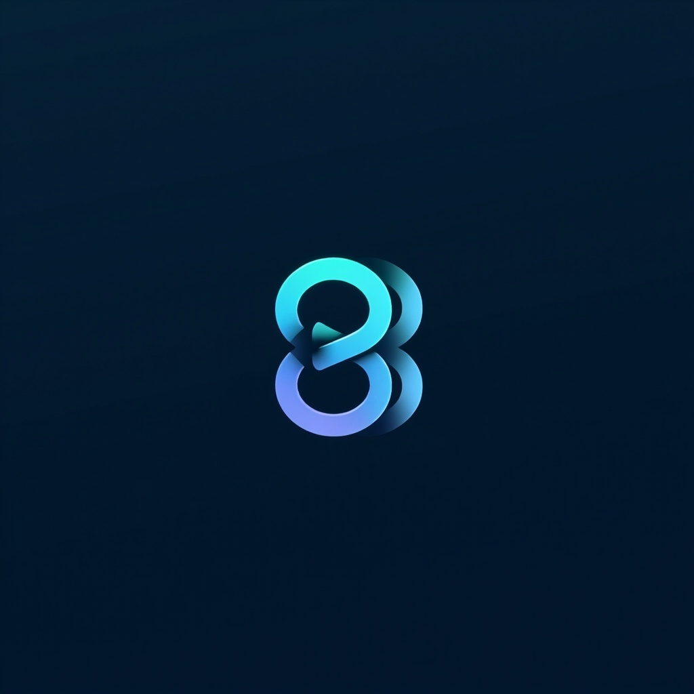
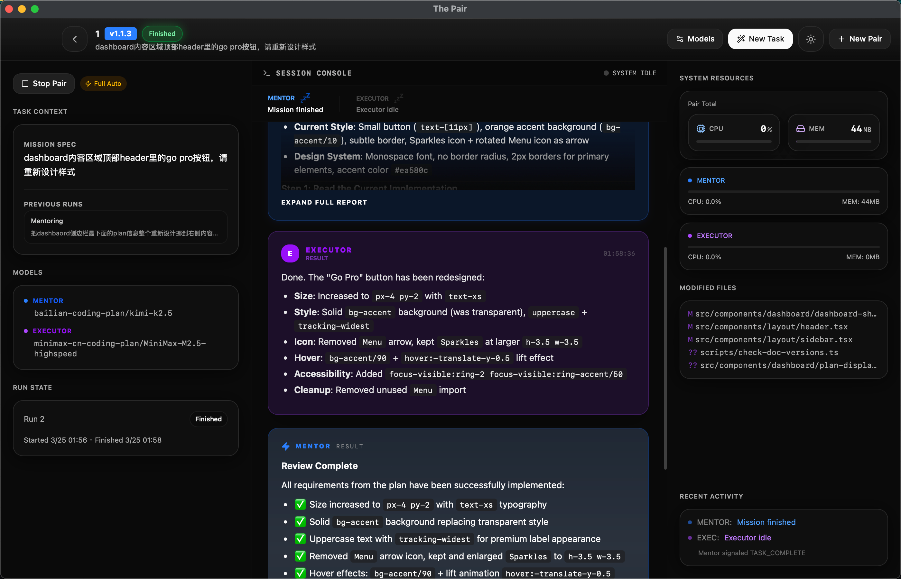

<!-- prettier-ignore -->
<div align="center">



# The Pair

> Currently facing environment blockers for the releases, will patch up very soon</p>

**Automated pair programming — grab a coffee while two AI agents cross-check each other's work**

[](https://www.apache.org/licenses/LICENSE-2.0)
[](https://github.com/timwuhaotian/the-pair/releases)
[](https://github.com/timwuhaotian/the-pair/actions)
[](https://www.typescriptlang.org/)
[](https://tauri.app/)
[](https://react.dev/)
[](CONTRIBUTING.md)
[](CHANGELOG.md)

**macOS** • **Windows** • **Linux**


_Watch Mentor and Executor agents collaborate in real-time_

</div>


---

## Overview

**Worried about AI code hallucinations?** The Pair solves this by running two AI agents that cross-check each other:

- **Mentor Agent** — Plans, reviews, and validates (read-only)
- **Executor Agent** — Writes code and runs commands

While they work, go grab a coffee. Come back to reviewed, cross-validated code.

### Key Benefits

- **Dual-Model Cross-Validation** — Two models check each other's work, dramatically reducing code hallucinations
- **Automated Collaboration** — Agents work together without constant human intervention
- **Real-Time Monitoring** — Watch CPU/memory usage per agent with live activity tracking
- **Git Integration** — Automatic tracking of all file changes made during a session
- **Human Oversight** — Step in when needed with approval/rejection workflow
- **Session Recovery** — Resume interrupted sessions with full conversation history restoration
- **Onboarding Wizard** — Guided first-time setup with model configuration and directory selection
- **Dark/Light Themes** — Automatic system theme detection with manual toggle

### Use Cases

- Autonomous coding sessions — Let AI agents iterate on features while you focus on review
- Code refactoring — Automated analysis and implementation of improvements
- Bug fixing — Agents collaborate to diagnose and resolve issues
- Learning tool — Observe how AI agents break down and solve problems
- Interrupted work recovery — Restore session state after app restart or crash

---

## Features

- **Dual-Agent Architecture** — Separation of planning (Mentor) and execution (Executor)
- **Full Automation Mode** — Agents work autonomously with workspace-scoped permissions
- **Real-Time Activity Tracking** — Live status showing agent activity (thinking, doing, waiting)
- **Resource Monitoring** — CPU and memory usage per agent, updated every second
- **Git Change Tracking** — Automatic detection of modified, added, or deleted files
- **Conversation History** — Full transcript of all agent interactions
- **Local-First** — Runs entirely on your machine, no cloud dependencies
- **Model Agnostic** — Works with any opencode-compatible AI model

---

## Screenshots

<div align="center">
  <picture>
    <source media="(prefers-color-scheme: dark)" srcset="./docs/assets/sc1.png">
    
  </picture>
  <p><em>Dashboard showing active pairs with real-time resource monitoring</em></p>
</div>

---

## Installation

Download the latest release from [GitHub Releases](https://github.com/timwuhaotian/the-pair/releases):

| Platform    | File                           |
| ----------- | ------------------------------ |
| **macOS**   | `the-pair-{version}.zip`       |
| **Windows** | `the-pair-{version}-setup.exe` |
| **Linux**   | `the-pair-{version}.AppImage`  |

### Homebrew (macOS)

```bash
brew install --cask the-pair
```

### From Source

```bash
git clone https://github.com/timwuhaotian/the-pair.git
cd the-pair
npm install
npm run build:mac  # or build:win / build:linux
```

On macOS, the build script will ensure the required Rust targets are installed before invoking Tauri. If you prefer to set them up manually, run:

```bash
rustup target add aarch64-apple-darwin x86_64-apple-darwin
```

---

## Quick Start

> [!NOTE]
> The Pair requires [opencode CLI](https://opencode.ai) to run AI agents.

### 1. Install opencode

```bash
brew install opencode
# Or visit: https://opencode.ai/install
```

### 2. Configure AI Models

Set up your AI providers in `~/.config/opencode/opencode.json`:

```json
{
  "provider": {
    "openai": { "options": { "apiKey": "your-api-key" } },
    "anthropic": { "options": { "apiKey": "your-api-key" } }
  }
}
```

> [!TIP]
> You can also use local models with [Ollama](https://ollama.com) for offline development.

### 3. Launch The Pair

Open from Applications folder or start menu.

### 4. Create Your First Pair

1. Click **New Pair** button
2. Configure: name, directory, task description, and AI models
3. Watch the agents work — Mentor plans, Executor implements, Mentor reviews
4. Monitor progress with real-time activity tracking and file changes

---

## Configuration

### opencode Configuration

The Pair uses your existing opencode configuration:

- **macOS/Linux**: `~/.config/opencode/opencode.json`
- **Windows**: `%APPDATA%/opencode/opencode.json`

### Pair Runtime

Each pair maintains its own runtime configuration in `.pair/runtime/<pairId>/` within your project directory, including session files, runtime permissions, and conversation history.

> [!NOTE]
> The Pair does not modify your global opencode permissions. All permissions are session-specific.

---

## Architecture

### Tech Stack

| Layer          | Technology            |
| -------------- | --------------------- |
| **Framework**  | Tauri 2.x             |
| **Backend**    | Rust                  |
| **Frontend**   | React 19 + TypeScript |
| **Styling**    | Tailwind CSS v4       |
| **State**      | Zustand               |
| **Animations** | Framer Motion         |
| **Icons**      | Lucide React          |

### System Architecture

```
┌─────────────────────────────────────────────────────────┐
│                    The Pair App                         │
├─────────────────────────────────────────────────────────┤
│  Frontend (React UI)                                    │
│  ┌──────────────┬──────────────┬──────────────────┐    │
│  │  Dashboard   │ Pair Detail  │    Settings      │    │
│  └──────────────┴──────────────┴──────────────────┘    │
│                          ↕ Tauri IPC                    │
├─────────────────────────────────────────────────────────┤
│  Backend (Rust)                                         │
│  ┌──────────────┬──────────────┬──────────────────┐    │
│  │ PairManager  │MessageBroker │ ProcessSpawner  │    │
│  │ (Lifecycle)  │ (State Machine)│ (opencode)     │    │
│  └──────────────┴──────────────┴──────────────────┘    │
│  ┌──────────────┬──────────────┬──────────────────┐    │
│  │ Git Tracker  │Resource Mon. │ Activity Tracker │    │
│  └──────────────┴──────────────┴──────────────────┘    │
└─────────────────────────────────────────────────────────┘
                            ↕
              ┌─────────────┴─────────────┐
              ↙                           ↘
     ┌─────────────────┐          ┌─────────────────┐
     │   opencode CLI  │          │   Git Repo      │
     │  (Mentor/Exec)  │          │  (Workspace)    │
     └─────────────────┘          └─────────────────┘
```

### Agent Workflow

```
Start → Initialize & Baseline → Mentoring Phase → Executing Phase → Reviewing Phase
                                                        ↓
                                              Done? ──Yes→ Finished
                                                 │
                                                 No
                                                 ↓
                                         (loop back to Mentoring)
```

---

## Development

### Prerequisites

- **Node.js** 22.22+
- **npm** or **pnpm**
- **Git**
- **Rustup** for desktop builds

Run a quick environment check before building:

```bash
npm run preflight
```

### Setup

```bash
git clone https://github.com/timwuhaotian/the-pair.git
cd the-pair
npm install
npm run dev
```

### Project Structure

```
the-pair/
├── src/
│   └── renderer/          # React frontend
│       └── src/
│           ├── App.tsx
│           ├── components/
│           └── store/
├── src-tauri/             # Rust backend
│   ├── src/
│   │   ├── lib.rs
│   │   ├── pair_manager.rs
│   │   ├── message_broker.rs
│   │   └── ...
│   └── Cargo.toml
├── build/                 # Build resources
└── package.json
```

### Scripts

| Command                   | Description                         |
| ------------------------- | ----------------------------------- |
| `npm run dev`             | Start hot-reload development server |
| `npm run preflight`       | Check local build prerequisites     |
| `npm run preflight:mac`   | Check macOS build prerequisites     |
| `npm run preflight:win`   | Check Windows build prerequisites   |
| `npm run preflight:linux` | Check Linux build prerequisites     |
| `npm test`                | Run JavaScript and Rust unit tests  |
| `npm run typecheck`       | Check TypeScript types              |
| `npm run lint`            | Run ESLint                          |
| `npm run format`          | Format with Prettier                |
| `npm run build:mac`       | Build for macOS                     |
| `npm run build:win`       | Build for Windows                   |
| `npm run build:linux`     | Build for Linux                     |

---

## FAQ

**Q: How does The Pair differ from single-agent AI coding tools?**

A: Single-agent tools rely on one model to write and self-review code, which can miss its own mistakes. The Pair uses two separate agents where the Mentor reviews the Executor's work, catching errors before they land.

**Q: Does The Pair require internet connectivity?**

A: The Pair runs entirely locally. Only the AI model API calls require internet (or local model setup via Ollama).

**Q: Can I use my own AI models?**

A: Yes, The Pair is model-agnostic and works with any opencode-compatible provider (OpenAI, Anthropic, Ollama, etc.).

**Q: What happens if an agent gets stuck in a loop?**

A: The Pair implements iteration limits. After a configured number of iterations, agents pause for human intervention.

---

<div align="center">

Built with ❤️ by [timwuhaotian](https://github.com/timwuhaotian)

**⭐ Star this repo if you find it helpful!**

</div>
