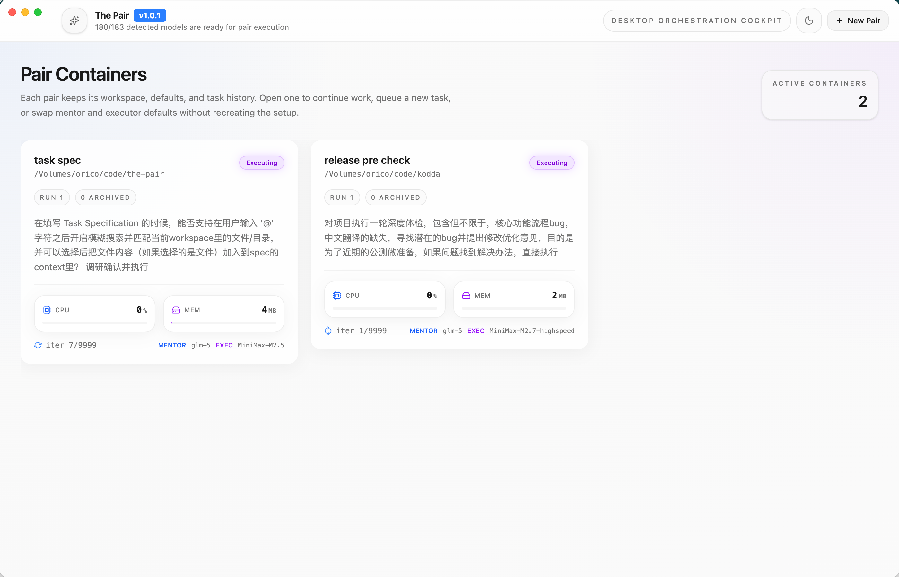
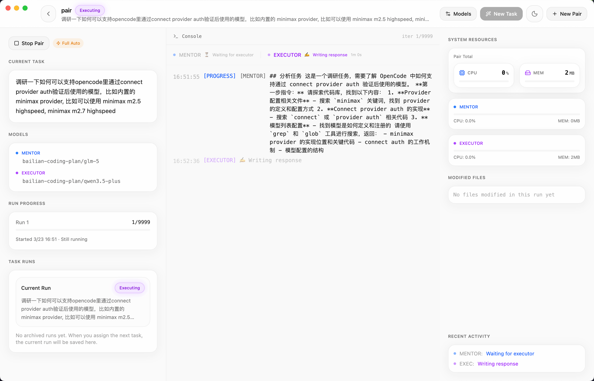
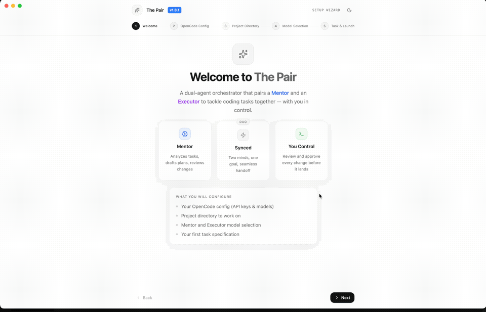

<div align="center">
  <h1>The Pair</h1>
  <p>Automated pair programming — grab a coffee while two AI agents cross-check each other's work</p>

[](https://www.apache.org/licenses/LICENSE-2.0)
[](https://github.com/timwuhaotian/the-pair/releases)
[](https://github.com/timwuhaotian/the-pair/actions)
[](https://www.typescriptlang.org/)
[](https://www.electronjs.org/)
[](https://react.dev/)
[](https://brew.sh/)
[](CONTRIBUTING.md)
[](https://prettier.io/)

  <p align="center">
    <strong>macOS</strong> • <strong>Windows</strong> • <strong>Linux</strong>
  </p>
</div>

---

## 📖 Table of Contents

- [What is The Pair?](#-what-is-the-pair)
- [Features](#-features)
- [Screenshots](#-screenshots)
- [Demo](#-demo)
- [Installation](#-installation)
- [Quick Start](#-quick-start)
- [Configuration](#-configuration)
- [Architecture](#-architecture)
- [Development](#-development)
- [Building](#-building)
- [Code Signing & Notarization](#-code-signing--notarization)
- [Publishing to Homebrew](#-publishing-to-homebrew)
- [Contributing](#-contributing)
- [FAQ](#-faq)
- [License](#-license)

---

## 🎯 What is The Pair?

**Worried about AI code hallucinations? You're not alone.**

The Pair solves this by running **two AI agents that cross-check each other**:

- **Mentor Agent** — Plans, reviews, and validates (read-only)
- **Executor Agent** — Writes code and runs commands

While they work, **go grab a coffee**. Come back to reviewed, cross-validated code.

Unlike single-agent tools where one model's mistakes go unchecked, The Pair's dual-agent architecture means the Executor writes code while the Mentor catches issues before they land.

### Key Benefits

- **Dual-Model Cross-Validation** — Two models check each other's work, dramatically reducing code hallucinations
- **Automated Collaboration** — Agents work together without constant human intervention
- **Real-Time Monitoring** — Watch CPU/memory usage per agent with live activity tracking
- **Git Integration** — Automatic tracking of all file changes made during a session
- **Human Oversight** — Step in when needed with approval/rejection workflow

### Use Cases

- 🤖 **Autonomous coding sessions** — Let AI agents iterate on features while you focus on review
- 📝 **Code refactoring** — Automated analysis and implementation of improvements
- 🐛 **Bug fixing** — Agents collaborate to diagnose and resolve issues
- 📚 **Learning tool** — Observe how AI agents break down and solve problems

---

## ✨ Features

- **Dual-Agent Architecture** — Separation of planning (Mentor) and execution (Executor)
- **Full Automation Mode** — Agents work autonomously with workspace-scoped permissions
- **Real-Time Activity Tracking** — Live status showing agent activity (thinking, doing, waiting)
- **Resource Monitoring** — CPU and memory usage per agent, updated every second
- **Git Change Tracking** — Automatic detection of modified, added, or deleted files
- **Conversation History** — Full transcript of all agent interactions
- **Local-First** — Runs entirely on your machine, no cloud dependencies
- **Model Agnostic** — Works with any opencode-compatible AI model (OpenAI, Anthropic, Ollama, etc.)

---

## 📸 Screenshots

<div align="center">
  <picture>
    <source media="(prefers-color-scheme: dark)" srcset="./docs/assets/multi-pairs-dark.png">
    
  </picture>
  <p><em>Dashboard showing active pairs with real-time resource monitoring</em></p>

  <picture>
    <source media="(prefers-color-scheme: dark)" srcset="./docs/assets/processing-dark.png">
    
  </picture>
  <p><em>Pair detail view with live agent activity and Git change tracking</em></p>
</div>

## 🎬 Demo

<div align="center">
  
  <p><em>Watch Mentor and Executor agents collaborate in real-time</em></p>
</div>

---

## 📥 Installation

### Homebrew (macOS)

```bash
brew tap timwuhaotian/the-pair
brew install --cask the-pair
```

### Manual Download

Download from [GitHub Releases](https://github.com/timwuhaotian/the-pair/releases):

| Platform    | File                           |
| ----------- | ------------------------------ |
| **macOS**   | `the-pair-{version}.dmg`       |
| **Windows** | `the-pair-{version}-setup.exe` |
| **Linux**   | `the-pair-{version}.AppImage`  |

### From Source

```bash
git clone https://github.com/timwuhaotian/the-pair.git
cd the-pair
npm install
npm run build:mac  # or build:win / build:linux
```

---

## 🚀 Quick Start

### Prerequisites

1. **Install opencode** — The Pair requires opencode CLI to run AI agents

   ```bash
   brew install opencode
   # Or visit: https://opencode.ai/install
   ```

2. **Configure AI Models** — Set up your AI providers in `~/.config/opencode/opencode.json`

   ```json
   {
     "provider": {
       "openai": { "options": { "apiKey": "your-api-key" } },
       "anthropic": { "options": { "apiKey": "your-api-key" } }
     }
   }
   ```

### First Run

1. **Launch The Pair** from Applications folder or start menu
2. **Create a New Pair** — Click "New Pair" button
3. **Configure Your Pair** — Set name, directory, task description, and choose AI models
4. **Watch the Magic** — Mentor plans, Executor implements, Mentor reviews — they loop until done
5. **Monitor Progress** — Watch real-time agent activity, resource usage, and file changes
6. **Intervene if Needed** — Use "Stop Pair" or "Retry Turn" for manual control

---

## ⚙️ Configuration

### opencode Configuration

The Pair uses your existing opencode configuration at:

- **macOS/Linux**: `~/.config/opencode/opencode.json`
- **Windows**: `%APPDATA%/opencode/opencode.json`

### Pair Runtime Configuration

Each pair maintains its own runtime configuration in `.pair/runtime/<pairId>/` within your project directory, including session files, runtime permissions, and conversation history.

**Note**: The Pair does not modify your global opencode permissions. All permissions are session-specific.

---

## 🏗️ Architecture

### Tech Stack

| Layer               | Technology            |
| ------------------- | --------------------- |
| **Framework**       | Electron 39           |
| **Frontend**        | React 19 + TypeScript |
| **Styling**         | Tailwind CSS v4       |
| **State**           | Zustand               |
| **Animations**      | Framer Motion         |
| **Icons**           | Lucide React          |
| **Process Monitor** | pidusage              |

### System Architecture

```
┌─────────────────────────────────────────────────────────┐
│                    The Pair App                         │
├─────────────────────────────────────────────────────────┤
│  Renderer Process (React UI)                            │
│  ┌──────────────┬──────────────┬──────────────────┐    │
│  │  Dashboard   │ Pair Detail  │    Settings      │    │
│  │  (List)      │ (Console)    │                  │    │
│  └──────────────┴──────────────┴──────────────────┘    │
│                          ↕ IPC                          │
│  Preload Script (contextBridge API)                    │
│                          ↕ IPC                          │
├─────────────────────────────────────────────────────────┤
│  Main Process (Node.js)                                 │
│  ┌──────────────┬──────────────┬──────────────────┐    │
│  │ PairManager  │MessageBroker │ ProcessSpawner  │    │
│  │ (Lifecycle)  │ (State Machine)│ (opencode)     │    │
│  └──────────────┴──────────────┴──────────────────┘    │
│                          ↕                               │
│  ┌──────────────┬──────────────┬──────────────────┐    │
│  │ Git Tracker  │Resource Mon. │ Activity Tracker │    │
│  └──────────────┴──────────────┴──────────────────┘    │
└─────────────────────────────────────────────────────────┘
                           ↕
             ┌─────────────┴─────────────┐
             ↙                           ↘
    ┌─────────────────┐          ┌─────────────────┐
    │   opencode CLI  │          │   Git Repo      │
    │  (Mentor/Exec)  │          │  (Workspace)    │
    └─────────────────┘          └─────────────────┘
```

### Agent Workflow

```
┌──────────────────────────────────────────────────────┐
│                 Pair Execution Flow                   │
└──────────────────────────────────────────────────────┘

     ┌─────────┐
     │  Start  │
     └────┬────┘
          │
          ▼
┌─────────────────┐
│ 1. Initialize   │ ← Git baseline, resources, activity
│    & Baseline   │
└────────┬────────┘
         │
         ▼
┌─────────────────┐
│ 2. Mentoring    │ ← Analyze task, create plan
│    Phase        │
└────────┬────────┘
         │
         ▼
┌─────────────────┐
│ 3. Executing    │ ← Implement, run tools, modify files
│    Phase        │
└────────┬────────┘
         │
         ▼
┌─────────────────┐
│ 4. Reviewing    │ ← Check output, plan next step
│    Phase        │
└────────┬────────┘
         │
    ┌────┴────┐
    │         │
    ▼         ▼
┌───────┐ ┌──────────┐
│ Done? │ │ Continue │
└───┬───┘ └────┬─────┘
    │          │
    │ Yes      │ No
    ▼          └─────────────┐
┌─────────┐                  │
│ Finished│ ◄────────────────┘
└─────────┘
```

---

## 💻 Development

### Prerequisites

- **Node.js** 20+ ([Download](https://nodejs.org/))
- **npm** or **pnpm**
- **Git**

### Setup

```bash
git clone https://github.com/timwuhaotian/the-pair.git
cd the-pair
npm install
npm run dev
```

### Project Structure

```
the-pair/
├── src/
│   ├── main/                  # Electron main process
│   │   ├── index.ts           # Entry point
│   │   ├── pairManager.ts     # Pair lifecycle management
│   │   ├── messageBroker.ts   # State machine & IPC
│   │   ├── processSpawner.ts  # opencode process spawning
│   │   ├── pairResourceMonitor.ts  # CPU/Memory monitoring
│   │   ├── pairGitTracker.ts  # Git change tracking
│   │   ├── agentTurn.ts       # Agent response parsing
│   │   └── types.ts           # TypeScript types
│   │
│   ├── preload/               # Context bridge
│   │   ├── index.ts           # API exposure
│   │   └── index.d.ts         # Type definitions
│   │
│   └── renderer/              # React frontend
│       ├── src/
│       │   ├── App.tsx        # Main component
│       │   ├── components/    # UI components
│       │   ├── store/         # Zustand store
│       │   └── types.ts       # Frontend types
│       └── index.html
│
├── build/                     # Build resources
├── resources/                 # App icons
├── package.json
├── electron-builder.yml
└── README.md
```

### Available Scripts

```bash
npm run dev              # Start hot-reload development server
npm run typecheck        # Check both main and renderer
npm run lint             # ESLint
npm run format           # Prettier
npm run build            # Build all platforms
npm run build:mac        # macOS only
npm run build:win        # Windows only
npm run build:linux      # Linux only
```

---

## 🔨 Building

### Build Requirements

- **macOS**: Xcode Command Line Tools
- **Windows**: Visual Studio Build Tools
- **Linux**: `libarchive`, `libappindicator3` (for AppImage)

### Build Commands

```bash
npm run build            # Build for current platform
npm run build:mac        # macOS only
npm run build:win        # Windows only
npm run build:linux      # Linux only
```

### Build Output

```
dist/
├── the-pair-{version}.dmg          # macOS installer
├── the-pair-{version}-setup.exe   # Windows installer
├── the-pair-{version}.AppImage    # Linux AppImage
└── the-pair-{version}.deb         # Debian package
```

---

## 🔐 Code Signing & Notarization

This repository uses a GitHub Actions release pipeline: push to main → detect version bump → build → codesign → notarize → package → create release → update Homebrew tap.

For detailed setup instructions, see [docs/code-signing.md](docs/code-signing.md).

### What You Need

- Apple Developer Program membership
- Developer ID Application certificate (exported as `.p12`)
- Apple ID app-specific password
- Apple Team ID

### GitHub Actions Secrets

| Secret                         | Description                                         |
| ------------------------------ | --------------------------------------------------- |
| `MACOS_SIGNING_IDENTITY`       | Developer ID Application certificate name           |
| `MACOS_CERTIFICATE_P12_BASE64` | Base64-encoded `.p12` certificate                   |
| `MACOS_CERTIFICATE_PASSWORD`   | Certificate export password                         |
| `APPLE_ID`                     | Apple Account email                                 |
| `APPLE_APP_SPECIFIC_PASSWORD`  | App-specific password for notarization              |
| `APPLE_TEAM_ID`                | 10-character Apple team identifier                  |
| `HOMEBREW_TAP_GITHUB_TOKEN`    | PAT with repo contents write access to the tap repo |

### Local Signed Build

```bash
export CSC_NAME="Developer ID Application: Your Name (TEAMID)"
export CSC_KEY_PASSWORD="your-p12-password"
export APPLE_ID="your-apple-id@example.com"
export APPLE_APP_SPECIFIC_PASSWORD="your-app-specific-password"
export TEAM_ID="YOURTEAMID"

npm run build:mac
```

### Verify Signature

```bash
APP_PATH=$(find dist -maxdepth 3 -name "*.app" | head -n 1)
codesign --verify --deep --strict --verbose=2 "$APP_PATH"
```

---

## 🍺 Publishing to Homebrew

Homebrew publishing is automatic via the release workflow:

1. Push to `main` with `package.json` version bump
2. GitHub Actions builds, signs, and notarizes the macOS app
3. Release `v<version>` is created
4. `Casks/the-pair.rb` is committed to `timwuhaotian/homebrew-the-pair`

### User Install Command

```bash
brew tap timwuhaotian/the-pair
brew install --cask the-pair
```

### Important Notes

- The tap can be public while the source repo remains private
- For Homebrew to work, release assets must be publicly accessible
- When ready for public distribution, ensure the source repo or assets are public

### Manual Cask Update

Use [update-cask.yml](.github/workflows/update-cask.yml) if a release already exists but the cask needs regeneration.

### Submit to Official Homebrew Cask

1. Fork [`Homebrew/homebrew-cask`](https://github.com/Homebrew/homebrew-cask)
2. Add your cask to `Casks/t/the-pair.rb`
3. Run `brew audit --cask the-pair`
4. Submit a pull request

---

## 🤝 Contributing

We welcome contributions! Please see [CONTRIBUTING.md](CONTRIBUTING.md) for details.

### Quick Start

```bash
git clone https://github.com/YOUR_USERNAME/the-pair.git
cd the-pair
git checkout -b feature/your-feature-name
git commit -m "feat: add your feature"
git push origin feature/your-feature-name
```

### Development Guidelines

- **Code Style**: Prettier + ESLint
- **Type Safety**: TypeScript, avoid `any`
- **Testing**: Add tests for new features
- **Commits**: Use [Conventional Commits](https://www.conventionalcommits.org/)

---

## ❓ FAQ

**Q: How does The Pair differ from single-agent AI coding tools?**

A: Single-agent tools rely on one model to write and self-review code, which can miss its own mistakes. The Pair uses two separate agents where the Mentor reviews the Executor's work, catching errors before they land.

**Q: Does The Pair require internet connectivity?**

A: The Pair runs entirely locally. Only the AI model API calls require internet (or local model setup via Ollama).

**Q: Can I use my own AI models?**

A: Yes, The Pair is model-agnostic and works with any opencode-compatible provider (OpenAI, Anthropic, Ollama, etc.).

**Q: What happens if an agent gets stuck in a loop?**

A: The Pair implements iteration limits. After a configured number of iterations, agents pause for human intervention.

---

## 📄 License

This project is licensed under the [Apache License 2.0](LICENSE).

```
Copyright 2026 timwuhaotian

Licensed under the Apache License, Version 2.0 (the "License");
you may not use this file except in compliance with the License.
You may obtain a copy of the License at

    http://www.apache.org/licenses/LICENSE-2.0

Unless required by applicable law or agreed to in writing, software
distributed under the License is distributed on an "AS IS" BASIS,
WITHOUT WARRANTIES OR CONDITIONS OF ANY KIND, either express or implied.
See the License for the specific language governing permissions and
limitations under the License.
```

---

<div align="center">
  <p>Built with ❤️ by <a href="https://github.com/timwuhaotian">timwuhaotian</a></p>
  <p>⭐ Star this repo if you find it helpful!</p>
</div>
